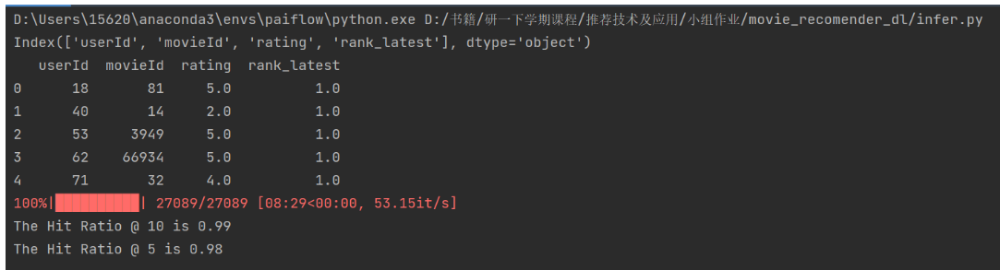

# 电影推荐系统算法部分

## 项目结构

data文件夹:存放原始数据集,需要全部放入
output文件夹:保存数据处理的中间结果
checkpoint文件夹:保存模型
model.py:目前保存的是竞拍的模型
train.py:用于训练模型
infer.py:用于推理
recall.py:目前正在实验,用于精排前的召回,解决精排时处理的数据量(候选集)过大的问题.

## 数据集

我们使用了movielens的数据集进行推荐系统的算法设计。传统的的协同过滤算法是电影推荐系统展示的主流，其中主要利用到了user, item, ratings三个数据集，利用到的数据特征较少，推荐准确率也存在不足。对此，我们对 MovieLens 数据集中的可利用部分进行了数据探索性分析，并利用到了Movielens数据集中列出的所有 45,000 部电影的元数据。该数据集由 2017 年 7 月或之前上映的电影组成。数据点包括演员、剧组、情节关键词、预算、收入、海报、上映日期、语言、制作公司、国家、TMDB 票数和票数平均值。

该数据集还包含包含 270,000 名用户对所有 45,000 部电影的 2600 万个评分的文件，评分范围为 1-5。

### 内容

该数据集由以下文件组成：

**movies_metadata.csv：**主要的电影元数据文件。包含有关 Full MovieLens 数据集中的 45,000 部电影的信息。功能包括海报、背景、预算、收入、发行日期、语言、制作国家和公司。

**keywords.csv：**包含我们 MovieLens 电影的电影情节关键字。以字符串化 JSON 对象的形式提供。

**credits.csv：**包含我们所有电影的演职人员信息。以字符串化 JSON 对象的形式提供。

**links.csv：**包含 Full MovieLens 数据集中所有电影的 TMDB 和 IMDB ID 的文件。

**ratings.csv：** 700 位用户对 9,000 部电影的 100,000 个评分的子集。

此数据集包含来自 270,000 名用户的 2600 万个评分和 750,000 个标签应用程序，而我们使用的ratings文件包含。

模型架构：

测试效果：

我们的测试集为27089例，其中每一个样例结构是：

用户，用户最近观看的一次电影，电影评分，rank_latest为1表示用户最近观看的一次电影

我们使用用户最近一次观看的电影为正样本；使用用户从未看过的电影随机选取19个作为负样本，进行模型的判别，即一个批次含有20个样例（同一个用户），最后对模型结果进行输出，按照预测概率由大到小进行排序，分别观察正样本在前五和前十中的结果。

可以看到，测试集的表现结果中，向用户推荐的top5电影中，命中率为98%；向用户推荐的top10电影中，命中率为99%，相较于传统的推荐算法，准确率有了质的的提升。

但由于**我们的数据集手机的用户及电影信息相对完整**，对于**新用户，新电影的冷启动问题**需要单独进行解决，我们将根据新用户注册时的输入信息及偏好进行最有可能喜欢的电影推荐，对于新电影，因为录入数据会较为充足，模型会根据已有用户的偏好进行一定比率的曝光，同时也可以设置新电影模块供用户浏览。

